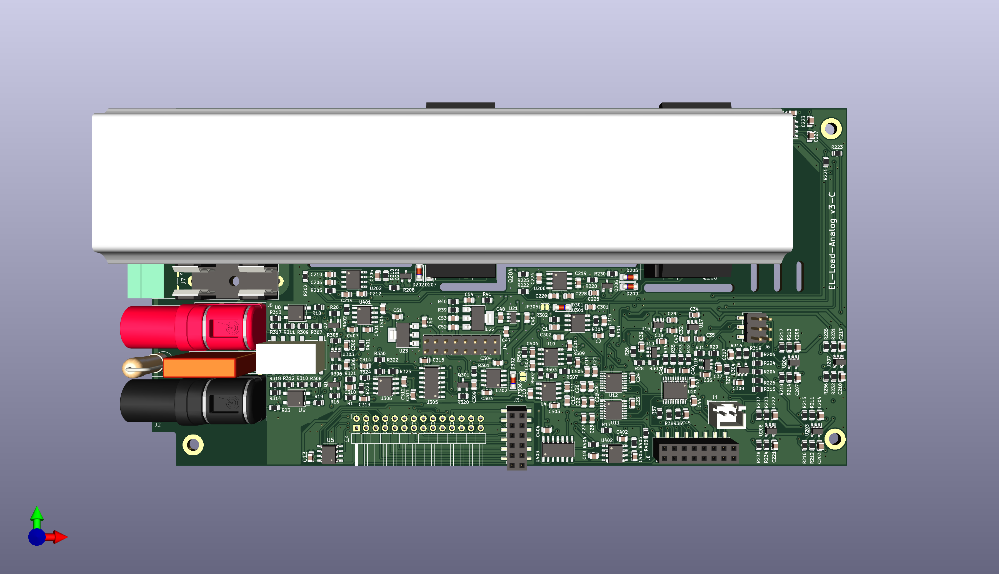
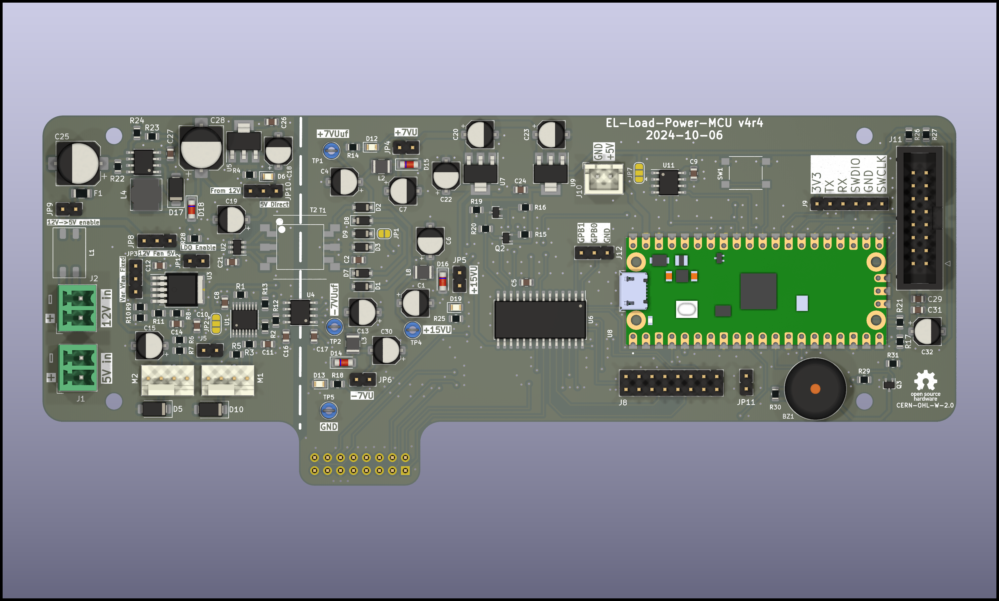
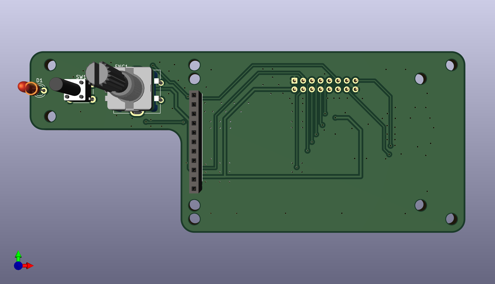
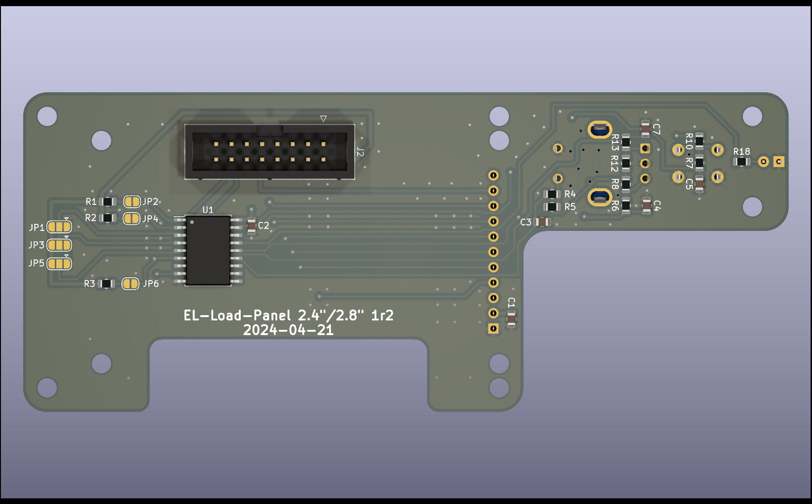
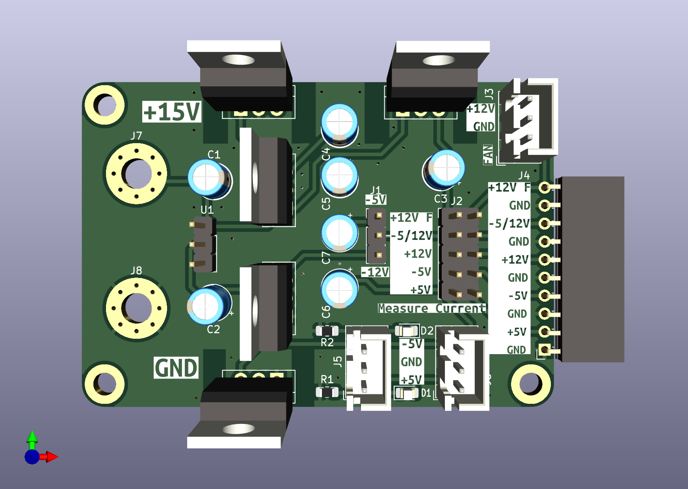
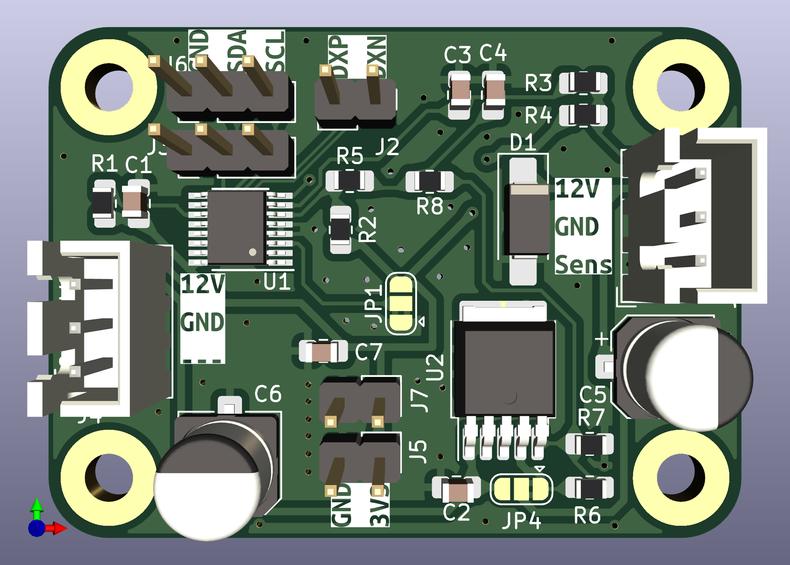

<!--
SPDX-FileCopyrightText: 2023 Jan Nieuwstad <jan.sources@nieuwstad.net>

SPDX-License-Identifier: CC-BY-SA-4.0
-->

# This is WORK IN PROGRESS.
The designs here are not finished or fully tested yet.

# Overview

The DCL8010 electronic load module features a DC Electronic Load with several modes and protections.
This project is the for the development boards for this project. There is a seperate git project for the .

## Specifications

* Modes: Constant Current (CC), Constant Voltage (CV), Constant Power (CP) and Constand Resistance (CR). CC and CV are implemented in hardware, CP and CR are software controlled and have a slower dynamic response.
* Limits:
  * Current: 1mA - 10A set and read
  * Voltage: 0.5V - 80V (set), 1mV-80V read
  * Power: 80W

* Protections:
In hardware:
  * User definable Over Voltage Protection (OVP), clamps load off within 1ms
  * User definable Over Current Protection (OCP), clamps load off within 1ms
With software support:
  * User definable Over Power Protection for a specific time in seconds (1-99)
  * User definable Over Temperature Protection for a specific time in seconds (1-99)

* Other hardware features:
  * Von: The minimum voltage needs to be present before the load is turned on. This can be set with or without latching. This is implemented in hardware and when on guarentees a gradual turn-on if a power source is 'hot plugged' or turned on. 
  * Temperature based fan control
  * Fan RPM readout
  * Heatsink temperature readout

## Design considerations

### Sizing
The Electronic Load was designed to complement a pair of BB3 DCP405 modules. Such a pair can deliver up to 80V (series configuration) or 10A (parallel configuration). The power is just maximized what is achievable with the small form factor of a BB3 module.

Minimum set voltage (an von cutoff) aim is as low as possible but at least 0.5V. A low Von cutoff is important to discharge for example AA battries (around 0.8V).

### Resolution and accurary
Aim is to have 0.1% full scale accurary after calibration. Calibration will be done in 100% in software.

This results in the follwing goals:
| Input/output | Range      | Accuracy  | Resolution | Remarks 
| ---          |  ---       | ---       | ---        | ---
| Current monitor | 0-10A   | 10mA      | 1mA        | 
| Current monitor | 0-1A    | 1mA       | 0.1mA      | not evaluted/tested yet
| Voltage monitor | 0-80V   | 80mV      | 1mV        | Accuracy probably: 10mV
| Voltage monitor | 0-9V    | 5mV       | 1mV        | not evaluted/tested yet
| Power measurements | 0-24h | 1s & 0.2% FS | 1s     | Perform accurate incremental calculations and timing
| Current set     | 0-10A   | 10mA      | 1mA        |
| Current set     | 0-1A    | 1mA       | 1mA        | not evaluted/tested yet
| Voltage set     | 0.5-80V | 80mV      | 1mV        |
| Voltage set     | 0.5-9V  | 5mV       | 1mV        |
| Resistance set  | ?       | ?         | ?          | 0.5% FS In software
| Power set       | ?       | 0.25W     | ?          | 0.5% FS in software
| Von set (80V range) | 0.25-50V | 0.2V  | 0.1V       | Difficult to calibrate
| Von set (9V range) | 0.25-6V | 0.1V  | 0.1V       | Difficult to calibrate
| OCP (10A range) | 0.1-10A | 100mA  | 10mA       | Difficult to calibrate
| OCP set (1A range) | 0.25-6V | 10mA  | 1mA       | Difficult to calibrate, not implemnted yet
| OVP (80V range) | 1-80V | 0.2V  | 0.1V       | Difficult to calibrate
| OVP set (9V range) | 0.25-9V | 0.1V  | 0.1V       | Difficult to calibrate, not tested yet

Using 16bit ADC's and DAC's this should be achievable with calibration done in software.

### Hardware / software partitioning
Everything requiring a response below 10ms is implemented directly in hardware. All other functionality is preferably done in software.
This results in the following decisions:
* Current and Voltage measurement and control loops are in analog circuitry
* Over voltage and over current protection measurement and shutdown are in hardware with a seperate clamp on the power MOSFET gates to shutdown as fast as possible. It is up to software to toggle pins to release the hwardware protection
* Von circuitry is implemented in hardware including the latch. The Von circuitry is important to avoid the MOSFET loops to go fully open (unregulated) when the supplied current and/or voltage is less then the set values. An unregulated situation would lead to large (= overshoot) spikes if the DUT suddenly starts providing more power (e.g. plug-in/turn on).
* To combine current, voltage and Von control a cross-over circuit is used where the smallest set current will get priority.

### Fail safely: 
An electronic load is often used to discharge batteries and due to the time this takes it is not realistic to assume the discharge is always attended by a person. If a failing component in the electronic load fails it might cause a short. A battery (or other power source without proection) being shorted is a serious fire hazard. Therefore the Electronic Load has a physical fuse and all possbile components that might faile are behind this fuse. This includes the input snubber network, transient and revserse polarity diode and of course the main MOSFETS of the electronic load. This protection is not perfect: It requires a >10A peak surge, but greatly reduces the risk.

## Limitations / Issues

Most limitations,TODO's and issues are now tracked on 

# PCBs

### EL-Load-Analog
Main PCB. Contains all the analog circuitry including MOSFETS. The DAC & ADC's are also on this board. Sizes of the PCB adhere to DIB standard (I hope).

### EL-Load-Power-MCU
PCB for stand alone deployment outside of BB3. This board contains an isolated power supply (input 5V) with fan controllers, MCU, GPIO and a bunch of connectors. 
It directly fits to the Analog PCB with an addidional IDC cable. There is also an IDC connector to the Front panel PCB.

### EL-Load-Panel
Front panel PCB for standalone deployment. Connects to EL-Load-Power-MCU. Has a connector for common 2.4/2.8" TFT touchscreen PCBs, 1 encoder, 1 microswitch and one 1 LED.

## Obsolete PCB's

### EL-Load-Simple-Power
Obsolete test board. Very simple 78*/79* based power supply to generate 2x+12V, 1x+5V, 1x-5V and optionally -12V. Was used for previous version of EL-Load-Analog.

### EL-Load-Fan-Controller
Obsolete test board for the fan controller. For testing MAX31760 with 12V LDO regulation. Not used anymore. MAX31760 is now on Power-MCU-board.

### EL-Load-Digital
Obsolete test board for the MCU + ADC + DAC + GPIO + Touchscreen connection. DAC + ADC's are now on analog board. MCU and GPIO are now on new Power-MCU-board.

# Ownership and License

This work is licensed under multiple licences:
 * All hardware designs are licensed under CERN-OHL-W-2.0
 * All original software source code is licensed under GPL-3.0-or-later.
 * All documentation is licensed under CC-BY-SA-4.0.
 * There are also parts imported from other sources. See the indivdual files for there specific licenses.

